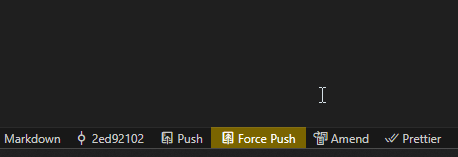

# GitRush

 Puts the Git features front and centre that I use most often in my workflow. And I always rush.

## Features

To the status bar it adds a variety of buttons for the Git operations I use in some workflows. All of these can be individually enabled or disabled in VS Code settings.

First button will display the first 8 characters of the Git HEAD and clicking it will copy the full hash to the clipboard.

Also to the status bar, an option to quickly call `git push` on click. There is an option (disabled by default) to `git push -f` instead. Obviously, use that with extreme caution.

You can also `commit --amend --no-edit` as the builtin VS Code method of doing this is a buried in a menu.

> This is compatible with multi repo VS Code workspaces. The 'active' repo is whatever repo the currently focused file in the text editor is from.

## Requirements

This only works with Git, no other SCM will work.

## Known Issues

- If there are no changes to push, it will display as an error notification (arguably this is fine)

## Release Notes

### 1.0.0

- Initial release
- Added commit hash on status bar and click to copy full hash
- Added git push button on status bar

## Upcoming

- Configurable force flag on push (in bright red)
- Commit all changes with amend button
- Commit list panel

**Enjoy!**
